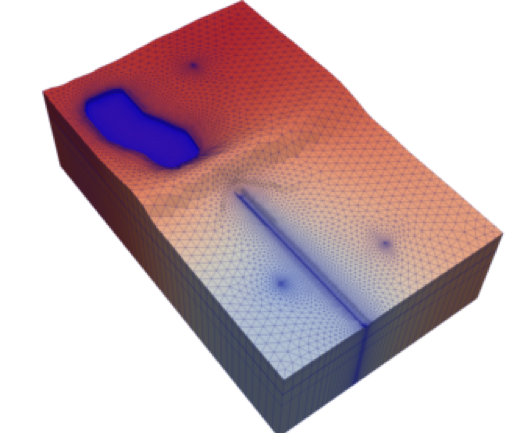

# JapanGWTA2023

This repository contains information for a lecture to the Japan Ground Water Technology Association.  The purpose of the lecture is to present recent advances for the MODFLOW 6 groundwater simulator.



## Software Installation

Lecture attendees may wish to follow along by running the FloPy/MODFLOW 6 examples.  This will require that software be installed prior to the lecture.  Required software includes:

1.  Python (preferably 3.10 or newer).  [Miniconda](https://docs.conda.io/en/latest/miniconda.html) is a popular Python distribution that runs on Windows, Mac, and Linux.

2.  Use conda to install a customized environment for FloPy and MODFLOW. The first step is create a file called `flopy_environment.yml`.  This file should contain the following contents.

```
name: flopy

channels:
  - conda-forge

dependencies:
  - python>=3.8
  - numpy>=1.15.0
  - matplotlib>=1.4.0
  - flopy
  - python-dateutil>=2.4.0
  - affine
  - scipy
  - pandas
  - pyshp
  - rasterio
  - fiona
  - descartes
  - pyproj
  - shapely>=1.8
  - geos
  - geojson
  - vtk
  - rasterstats
  - pyvista
  - imageio
  - pymetis
  - trame
  - jupyter

  # pip installations
  - pip
  - pip:
      - git+https://github.com/MODFLOW-USGS/modflowapi.git
```

After this file is created, run the following command from a terminal.

```
$ conda env create -f flopy_environment.yml
```

Whenever you want to use this FloPy environment, you will need to activate it with the following command.

```
conda activate flopy
```

3.  Install MODFLOW executables and related programs.  After FloPy has been installed, MODFLOW executables can be downloaded to your computer using the [get-modflow](https://github.com/modflowpy/flopy/blob/develop/docs/get_modflow.md) utility, which is installed with FloPy. The following command is one way to use `get-modflow`, which will download the executables and make them available for use with FloPy scripts.  Make sure that the flopy environment is active before you run `get-modflow`.

```
$ get-modflow :flopy 
```

## Examples using FloPy and MODFLOW 6
### Example 1 -- Toth Flow System

```
import matplotlib.pyplot as plt
import numpy as np
import flopy
ws = './ex1'
name = 'mymodel'

def get_z(z0, a, b, alpha, x):
    return z0 + x * np.tan(alpha) + a * np.sin(b * x / np.cos(alpha)) / np.cos(alpha)

Lx = 20000
Lz = 10000
nlay = 400
nrow = 1
ncol = 200
top = Lz
bot = 0
dx = Lx / ncol
dz = (top - bot) / nlay
botm = [top - (b + 1) * dz for b in range(nlay)]
a = 200.
alpha = np.arctan2(1000, Lx)
period = 5000.
b = 2 * np.pi / period
x = np.arange(dx / 2, Lx + dx / 2, dx)
z = get_z(Lz, a, b, alpha, x)
chdspd = [[(0, 0, j), z[j]] for j in range(ncol)]

sim = flopy.mf6.MFSimulation(sim_name=name, sim_ws=ws, exe_name='mf6')
tdis = flopy.mf6.ModflowTdis(sim)
ims = flopy.mf6.ModflowIms(sim, print_option="all", inner_maximum=100)
gwf = flopy.mf6.ModflowGwf(sim, modelname=name, save_flows=True)
dis = flopy.mf6.ModflowGwfdis(
    gwf, nlay=nlay, nrow=nrow, ncol=ncol, top=top, botm=botm, delr=dx)
ic = flopy.mf6.ModflowGwfic(gwf, strt=top)
npf = flopy.mf6.ModflowGwfnpf(gwf, save_specific_discharge=True)
chd = flopy.mf6.ModflowGwfchd(gwf, stress_period_data=chdspd)
oc = flopy.mf6.ModflowGwfoc(gwf,
                            budget_filerecord=f"{name}.bud",
                            head_filerecord=f"{name}.hds",
                            printrecord=[('HEAD', 'ALL'), ('BUDGET', 'ALL')],
                            saverecord=[('HEAD', 'ALL'), ('BUDGET', 'ALL')])
sim.write_simulation()
sim.run_simulation()

head = gwf.output.head().get_data()
bud = gwf.output.budget()
spdis = bud.get_data(text='DATA-SPDIS')[0]
qx, qy, qz = flopy.utils.postprocessing.get_specific_discharge(spdis, gwf)
u = qx.reshape((nlay, ncol))
phi = u[-1::-1].cumsum(axis=0)
phi = np.flipud(phi)

fig, ax = plt.subplots(figsize=(10, 10))
ax.set_aspect(1)
pxs = flopy.plot.PlotCrossSection(gwf, ax=ax, line={"row":0})
pxs.contour_array(
    head, 
    levels=np.arange(Lz, z.max(), 25), 
    linewidths=1., 
    colors="k",
    linestyles="dashed",
)
pxs.contour_array(phi, levels=np.linspace(phi.min(), phi.max(), 10))
#pxs.plot_vector(qx, qy, qz, normalize=True, color="black")
ax.set_xlim(0, 20000)
ax.set_ylim(0, 11000)
ax.plot(x, z)
```

### Example 2 -- Regular Grid

```
import pathlib as pl
import matplotlib.pyplot as plt
import numpy as np
from shapely.geometry import Polygon, LineString
import flopy

ws = './ex2'
name = 'mymodel'
tempdir = pl.Path(ws, "temp")
tempdir.mkdir(parents=True, exist_ok=True)

domain = Polygon([
    [1831.38, 6335.54],
    [4337.73, 6851.13],
    [6428.74, 6707.91],
    [8662.98, 6493.08],
    [9350.43, 5891.56],
    [9235.86, 4717.15],
    [8963.74, 3685.97],
    [8691.62, 2783.68],
    [8047.13, 2038.94],
    [7416.96, 578.09],
    [6414.42, 105.46],
    [5354.59, 205.72],
    [4624.17, 363.26],
    [3363.83, 563.77],
    [1330.11, 1809.78],
    [399.18, 2998.51],
    [914.77, 5132.49],
])

Lx = 10000
Ly = 8000
nlay = 1
nrow = 32
ncol = 40
delr = Lx / ncol * np.ones(ncol, dtype=float)
delc = Ly / nrow * np.ones(nrow, dtype=float)
top = 100 * np.ones((nrow, ncol), dtype=float)
botm = np.zeros((nlay, nrow, ncol), dtype=float)
sg = flopy.discretization.StructuredGrid(
    nlay=nlay,
    nrow=nrow,
    ncol=ncol,
    delr=delr,
    delc=delc,
    top=top,
    botm=botm
)
idomain = np.zeros((nlay, nrow, ncol), dtype=int)
gi = flopy.utils.GridIntersect(sg)

# inside domain polygon
ixp = gi.intersect(domain)
for i, j in ixp["cellids"]:
    idomain[:, i, j] = 1

# touching domain polygon
ls = LineString([p for p in domain.exterior.coords])    
ixl = gi.intersect(ls)
for i, j in ixl["cellids"]:
    idomain[:, i, j] = 2

sim = flopy.mf6.MFSimulation(sim_name=name, sim_ws=ws, exe_name='mf6')
tdis = flopy.mf6.ModflowTdis(sim)
ims = flopy.mf6.ModflowIms(sim, print_option="all", inner_maximum=100)
gwf = flopy.mf6.ModflowGwf(sim, modelname=name, save_flows=True)
dis = flopy.mf6.ModflowGwfdis(
    gwf, nlay=nlay, nrow=nrow, ncol=ncol, delr=delr, delc=delc, 
    top=top, botm=botm, idomain=idomain)
ic = flopy.mf6.ModflowGwfic(gwf, strt=top)
npf = flopy.mf6.ModflowGwfnpf(gwf, save_specific_discharge=True)
chdspd = [[(0, i, j), 1.] for i, j in ixl["cellids"]]
chd = flopy.mf6.ModflowGwfchd(gwf, stress_period_data=chdspd)
rch = flopy.mf6.ModflowGwfrcha(gwf, recharge=0.001)
oc = flopy.mf6.ModflowGwfoc(gwf,
                            budget_filerecord=f"{name}.bud",
                            head_filerecord=f"{name}.hds",
                            printrecord=[('HEAD', 'ALL'), ('BUDGET', 'ALL')],
                            saverecord=[('HEAD', 'ALL'), ('BUDGET', 'ALL')])
sim.write_simulation()
sim.run_simulation()

head = gwf.output.head().get_data()
bud = gwf.output.budget()
spdis = bud.get_data(text='DATA-SPDIS')[0]
qx, qy, qz = flopy.utils.postprocessing.get_specific_discharge(spdis, gwf)

fig, ax = plt.subplots(figsize=(8, 8))
ax.set_aspect(1)
pmv = flopy.plot.PlotMapView(gwf, ax=ax)
#pmv.plot_grid()
pmv.plot_bc(ftype="CHD")
#pmv.plot_array(head)
pmv.plot_vector(qx, qy, normalize=True, color="black", istep=1, jstep=1)
pmv.contour_array(head)
```

### Example 3 -- Quadtree Grid

```
import pathlib as pl
import matplotlib.pyplot as plt
import numpy as np
from shapely.geometry import Polygon, LineString
import flopy
from flopy.utils.gridgen import Gridgen

ws = './ex3'
name = 'mymodel'
gridgen_ws = pl.Path(ws, "gridgen")
gridgen_ws.mkdir(parents=True, exist_ok=True)

domain = [[
    [1831.38, 6335.54],
    [4337.73, 6851.13],
    [6428.74, 6707.91],
    [8662.98, 6493.08],
    [9350.43, 5891.56],
    [9235.86, 4717.15],
    [8963.74, 3685.97],
    [8691.62, 2783.68],
    [8047.13, 2038.94],
    [7416.96, 578.09],
    [6414.42, 105.46],
    [5354.59, 205.72],
    [4624.17, 363.26],
    [3363.83, 563.77],
    [1330.11, 1809.78],
    [399.18, 2998.51],
    [914.77, 5132.49],
    [1831.38, 6335.54],
]]

Lx = 10000
Ly = 8000
nlay = 1
nrow = 32
ncol = 40
delr = Lx / ncol * np.ones(ncol, dtype=float)
delc = Ly / nrow * np.ones(nrow, dtype=float)
top = 100 * np.ones((nrow, ncol), dtype=float)
botm = np.zeros((nlay, nrow, ncol), dtype=float)
sg = flopy.discretization.StructuredGrid(
    nlay=nlay,
    nrow=nrow,
    ncol=ncol,
    delr=delr,
    delc=delc,
    top=top,
    botm=botm
)

g = Gridgen(sg, model_ws=gridgen_ws, surface_interpolation="interpolate")
g.add_active_domain([domain], range(nlay))
g.add_refinement_features(domain, "line", level=1, layers=range(nlay))
poly = [[[(6000, 4000), (7000, 4000), (7000, 5000), (6000, 5000), (6000, 4000)]]]
g.add_refinement_features(poly, "polygon", level=2, layers=range(nlay))
g.build()

sim = flopy.mf6.MFSimulation(sim_name=name, sim_ws=ws, exe_name='mf6')
tdis = flopy.mf6.ModflowTdis(sim)
ims = flopy.mf6.ModflowIms(sim, print_option="all", inner_maximum=100)
gwf = flopy.mf6.ModflowGwf(sim, modelname=name, save_flows=True)
disv = flopy.mf6.ModflowGwfdisv(
    gwf, **g.get_gridprops_disv())
ic = flopy.mf6.ModflowGwfic(gwf, strt=top)
npf = flopy.mf6.ModflowGwfnpf(gwf, save_specific_discharge=True)

gi = flopy.utils.GridIntersect(gwf.modelgrid)
ls = LineString(domain[0])
chdspd = [[(0, j), 1.] for j in np.array(gi.intersects(ls)["cellids"], dtype=int)]
chd = flopy.mf6.ModflowGwfchd(gwf, stress_period_data=chdspd)
rch = flopy.mf6.ModflowGwfrcha(gwf, recharge=0.001)
oc = flopy.mf6.ModflowGwfoc(gwf,
                            budget_filerecord=f"{name}.bud",
                            head_filerecord=f"{name}.hds",
                            printrecord=[('HEAD', 'ALL'), ('BUDGET', 'ALL')],
                            saverecord=[('HEAD', 'ALL'), ('BUDGET', 'ALL')])
sim.write_simulation()
sim.run_simulation()

head = gwf.output.head().get_data()
bud = gwf.output.budget()
spdis = bud.get_data(text='DATA-SPDIS')[0]
qx, qy, qz = flopy.utils.postprocessing.get_specific_discharge(spdis, gwf)

fig, ax = plt.subplots(figsize=(8, 8))
ax.set_aspect(1)
pmv = flopy.plot.PlotMapView(gwf, ax=ax)
pmv.plot_grid()
pmv.plot_bc(ftype="CHD")
pmv.plot_vector(qx, qy, normalize=True, color="black")
pmv.contour_array(head)
```

### Example 4 -- Voronoi Grid

```
import pathlib as pl
import matplotlib.pyplot as plt
import numpy as np
from shapely.geometry import Polygon, LineString
import flopy
import flopy.utils.triangle
import flopy.utils.voronoi

ws = './ex4'
name = 'mymodel'
tempdir = pl.Path(ws, "temp")
tempdir.mkdir(parents=True, exist_ok=True)

domain = Polygon([
    [1831.38, 6335.54],
    [4337.73, 6851.13],
    [6428.74, 6707.91],
    [8662.98, 6493.08],
    [9350.43, 5891.56],
    [9235.86, 4717.15],
    [8963.74, 3685.97],
    [8691.62, 2783.68],
    [8047.13, 2038.94],
    [7416.96, 578.09],
    [6414.42, 105.46],
    [5354.59, 205.72],
    [4624.17, 363.26],
    [3363.83, 563.77],
    [1330.11, 1809.78],
    [399.18, 2998.51],
    [914.77, 5132.49],
])
area_max = 100.0**2
tri = flopy.utils.triangle.Triangle(maximum_area=area_max, angle=30, model_ws=tempdir)
tri.add_polygon(domain)
tri.build(verbose=False)
vor = flopy.utils.voronoi.VoronoiGrid(tri)
disv_gridprops = vor.get_disv_gridprops()

top = 100.
botm = [0.]
nlay = 1
sim = flopy.mf6.MFSimulation(sim_name=name, sim_ws=ws, exe_name='mf6')
tdis = flopy.mf6.ModflowTdis(sim)
ims = flopy.mf6.ModflowIms(sim, print_option="all", inner_maximum=100)
gwf = flopy.mf6.ModflowGwf(sim, modelname=name, save_flows=True)
disv = flopy.mf6.ModflowGwfdisv(
    gwf, nlay=nlay, **vor.get_disv_gridprops(), top=top, botm=botm)
ic = flopy.mf6.ModflowGwfic(gwf, strt=top)
npf = flopy.mf6.ModflowGwfnpf(gwf, save_specific_discharge=True)

gi = flopy.utils.GridIntersect(gwf.modelgrid)
ls = LineString([p for p in domain.exterior.coords])
chdspd = [[(0, j), 1.] for j in np.array(gi.intersects(ls)["cellids"], dtype=int)]
chd = flopy.mf6.ModflowGwfchd(gwf, stress_period_data=chdspd)
rch = flopy.mf6.ModflowGwfrcha(gwf, recharge=0.001)
oc = flopy.mf6.ModflowGwfoc(gwf,
                            budget_filerecord=f"{name}.bud",
                            head_filerecord=f"{name}.hds",
                            printrecord=[('HEAD', 'ALL'), ('BUDGET', 'ALL')],
                            saverecord=[('HEAD', 'ALL'), ('BUDGET', 'ALL')])
sim.write_simulation()
sim.run_simulation()

head = gwf.output.head().get_data()
bud = gwf.output.budget()
spdis = bud.get_data(text='DATA-SPDIS')[0]
qx, qy, qz = flopy.utils.postprocessing.get_specific_discharge(spdis, gwf)

fig, ax = plt.subplots(figsize=(8, 8))
ax.set_aspect(1)
pmv = flopy.plot.PlotMapView(gwf, ax=ax)
pmv.plot_grid()
pmv.plot_bc(ftype="CHD")
pmv.plot_vector(qx, qy, normalize=True, color="black")
pmv.contour_array(head)
```

### Example 5 -- Local Grid Refinement

```
import pathlib as pl
import matplotlib.pyplot as plt
import numpy as np
from shapely.geometry import Polygon, LineString
import flopy
from flopy.utils.lgrutil import Lgr

ws = './ex5'
name = 'mymodel'

domain = Polygon([
    [1831.38, 6335.54],
    [4337.73, 6851.13],
    [6428.74, 6707.91],
    [8662.98, 6493.08],
    [9350.43, 5891.56],
    [9235.86, 4717.15],
    [8963.74, 3685.97],
    [8691.62, 2783.68],
    [8047.13, 2038.94],
    [7416.96, 578.09],
    [6414.42, 105.46],
    [5354.59, 205.72],
    [4624.17, 363.26],
    [3363.83, 563.77],
    [1330.11, 1809.78],
    [399.18, 2998.51],
    [914.77, 5132.49],
])

Lx = 10000
Ly = 8000
nlayp = 1
nrowp = 32
ncolp = 40
delrp = Lx / ncolp * np.ones(ncolp, dtype=float)
delcp = Ly / nrowp * np.ones(nrowp, dtype=float)
topp = 100 * np.ones((nrowp, ncolp), dtype=float)
botmp = np.zeros((nlayp, nrowp, ncolp), dtype=float)
idomainp = np.ones((nlayp, nrowp, ncolp), dtype=int)
idomainp[:, 11:15, 23:27] = 0

lgr = Lgr(
    nlayp,
    nrowp,
    ncolp,
    delrp,
    delcp,
    topp,
    botmp,
    idomainp,
    ncpp=3,
    ncppl=[3],
    xllp=0.0,
    yllp=0.0,
)

sg = flopy.discretization.StructuredGrid(
    nlay=nlayp,
    nrow=nrowp,
    ncol=ncolp,
    delr=delrp,
    delc=delcp,
    top=topp,
    botm=botmp
)

idomain = np.zeros((nlayp, nrowp, ncolp), dtype=int)
gi = flopy.utils.GridIntersect(sg)

# inside domain polygon
ixp = gi.intersect(domain)
for i, j in ixp["cellids"]:
    idomain[:, i, j] = 1

# touching domain polygon
ls = LineString([p for p in domain.exterior.coords])    
ixl = gi.intersect(ls)
for i, j in ixl["cellids"]:
    idomain[:, i, j] = 2
    
idomain[np.where(idomainp == 0)] = 0

sim = flopy.mf6.MFSimulation(sim_name=name, sim_ws=ws, exe_name='mf6')
tdis = flopy.mf6.ModflowTdis(sim)
ims = flopy.mf6.ModflowIms(sim)

# parent model
name = "parent"
gwf = flopy.mf6.ModflowGwf(sim, modelname=name, save_flows=True)
dis = flopy.mf6.ModflowGwfdis(
    gwf, 
    nlay=nlayp, 
    nrow=nrowp, 
    ncol=ncolp, 
    delr=delrp, 
    delc=delcp,
    top=topp,
    botm=botmp,
    idomain=idomain,
)
ic = flopy.mf6.ModflowGwfic(gwf)
npf = flopy.mf6.ModflowGwfnpf(gwf, save_specific_discharge=True)
chdspd = [[(0, i, j), 1.] for i, j in ixl["cellids"]]
chd = flopy.mf6.ModflowGwfchd(gwf, stress_period_data=chdspd)
rch = flopy.mf6.ModflowGwfrcha(gwf, recharge=0.001)
budget_file = name + '.bud'
head_file = name + '.hds'
oc = flopy.mf6.ModflowGwfoc(gwf,
                            budget_filerecord=budget_file,
                            head_filerecord=head_file,
                            saverecord=[('HEAD', 'ALL'), ('BUDGET', 'ALL')])
gwf_parent = gwf

# child model
name = "child"
gwf = flopy.mf6.ModflowGwf(sim, modelname=name, 
                           save_flows=True)
dis = flopy.mf6.ModflowGwfdis(
    gwf, 
    nlay=lgr.nlay, 
    nrow=lgr.nrow, 
    ncol=lgr.ncol, 
    delr=lgr.delr, 
    delc=lgr.delc,
    top=lgr.top,
    botm=lgr.botm,
    xorigin=lgr.xll,
    yorigin=lgr.yll,
)
ic = flopy.mf6.ModflowGwfic(gwf)
npf = flopy.mf6.ModflowGwfnpf(gwf, save_specific_discharge=True)
rch = flopy.mf6.ModflowGwfrcha(gwf, recharge=0.001)
budget_file = name + '.bud'
head_file = name + '.hds'
oc = flopy.mf6.ModflowGwfoc(gwf,
                            budget_filerecord=budget_file,
                            head_filerecord=head_file,
                            printrecord=[('HEAD', 'ALL'), ('BUDGET', 'ALL')],
                            saverecord=[('HEAD', 'ALL'), ('BUDGET', 'ALL')],
)
gwf_child = gwf

# setup the exchange
exchangedata = lgr.get_exchange_data(
    angldegx=True, 
    cdist=True
)
flopy.mf6.ModflowGwfgwf(sim, 
                        exgmnamea="parent",
                        exgmnameb="child",
                        xt3d=True,
                        nexg=len(exchangedata),
                        auxiliary=["ANGLDEGX", "CDIST"],
                        exchangedata=exchangedata)

sim.write_simulation()
sim.run_simulation()

fig, ax = plt.subplots(1, 1)
ax.set_aspect("equal")
for iplot, gwf in enumerate([gwf_child, gwf_parent]):
    head = gwf.output.head().get_data()
    bud = gwf.output.budget()
    spdis = bud.get_data(text='DATA-SPDIS')[0]
    qx, qy, qz = flopy.utils.postprocessing.get_specific_discharge(spdis, gwf)

    pmv = flopy.plot.PlotMapView(gwf, ax=ax)
    if iplot == 1:
        pmv.plot_bc(ftype="CHD")
        pmv.plot_vector(qx, qy, normalize=True, color="black")
    #c = pmv.plot_array(head, masked_values=[1.e30])
    #pmv.plot_grid(colors='black')
    pmv.contour_array(head)
plt.colorbar(c, shrink=0.5)
```

